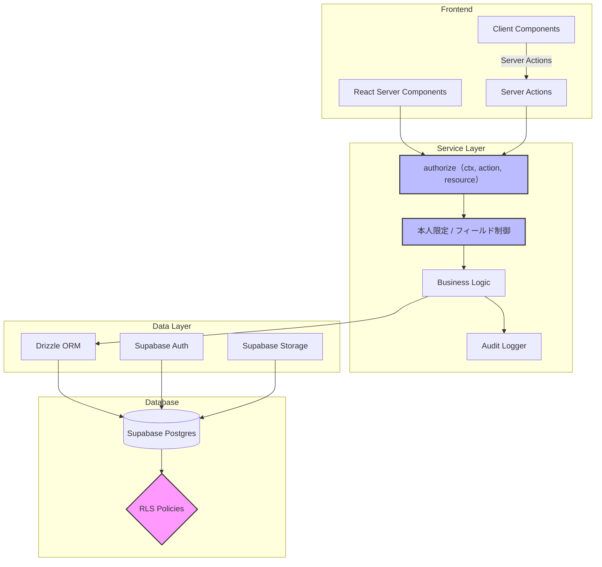

<div align="center">

# FondraHR

**マルチテナント型タレントマネジメント SaaS**

従業員情報・スキル・1on1記録・評価を一元管理する。<br>
テナント分離と認可設計の堅牢さを主題に据えた個人開発プロジェクト。

[](https://github.com/TakuyaMiyashita/fondra-hr/actions/workflows/ci.yml)
[](#ライセンス)


[検証環境](https://fondra-hr-staging.vercel.app) ・ [設計ドキュメント](./docs/) ・ [テスト戦略](./docs/testing.md)

</div>

---


<table>
<tr>
<td width="50%"></td>
<td width="50%"></td>
</tr>
<tr>
<td align="center"><sub>従業員一覧（検索・絞り込み・並べ替えは URL 状態）</sub></td>
<td align="center"><sub>組織図（ドラッグ&ドロップで階層を編集）</sub></td>
</tr>
</table>

## このプロジェクトの主題

SaaS で最も壊してはいけないのは**他社のデータが見えること**と**権限を越えた操作ができること**の2つ。
機能の数ではなく、この2点をどう設計し、どう壊れないことを示すかに時間を使っている。

### 1. テナント分離は二重に持つ

| レイヤー          | 役割   | 仕組み                                                |
| ----------------- | ------ | ----------------------------------------------------- |
| **Service Layer** | 主防御 | 全クエリに `WHERE org_id = ctx.orgId` を付与          |
| **RLS**           | 安全網 | `org_id` の単純チェックのみ。ロール別制御は持たせない |

どちらか一方が漏れてもデータは守られる。RLS を単純に保つのは、複雑な条件を
SQL で書くと壊れたときに気付けないため。細かな制御は TypeScript 側に寄せる。

### 2. 認可は3段階で絞る

ロール × リソースの表だけでは「自分のデータだけ」を表現できない。

```
[RLS]           org_id チェック          → テナント外を完全遮断
      ↓
[Service Layer] authorize()              → ロール × リソース × 操作
      ↓
[Service Layer] 本人限定                 → 当事者でない「行」を除外
      ↓
[Service Layer] フィールド制御           → 権限の無い「列」を null に潰す
```

- **本人限定** — member は自分が当事者の 1on1・自分が評価者の評価だけを扱える。
  判定はログインユーザーと従業員レコードの紐付け（`employees.user_id`）で行い、
  **未紐付けは「何も見えない」に倒す**
- **フィールド制御** — 従業員の read は全ロールに開いているため、行単位では
  生年月日や評価コメントを守れない。読み取り時に列を null へ潰す
- **評価コメントの本人開示は確定後のみ** — 確定は開示のスイッチそのものなので、
  確定への遷移は admin 以上に限定している

詳細は [認可マトリクス](./docs/database/authorization-matrix.md) と
[認証・認可モデル](./docs/architecture/auth-and-authorization.md)。

### 3. 「見えないこと」は対照群とセットで検証する

e2e は owner / member / viewer の3セッションを用意し、機微な値がページの
どこにも現れないことを検証する。**同じ値が owner では見えることを確認する
対照群を必ず併記する** — これが無いと、データが存在しないだけで
「見えない」が成立し、テストが素通りしていることに気付けない。

```
owner — 対照群
  ✓ 他人の生年月日が見える
member — 他人の個人情報
  ✓ 他人の生年月日は表示されない
  ✓ 自分の生年月日は表示される
```

## アーキテクチャ



RSC / Server Action から直接 Drizzle を呼ばない。必ず Service Layer を経由し、
`authorize()` → DB操作 → 監査ログの順で処理する。DB アクセスは Drizzle に一本化し、
Supabase JS Client は Auth と Storage にのみ使う。

## 技術スタック

| カテゴリ       | 技術                                               |
| -------------- | -------------------------------------------------- |
| フレームワーク | Next.js 16（App Router / React Server Components） |
| 言語           | TypeScript（strict）                               |
| DB / BaaS      | Supabase（Postgres + Auth + Storage + RLS）        |
| ORM            | Drizzle ORM                                        |
| UI             | Tailwind CSS + shadcn/ui + lucide-react            |
| データ表示     | TanStack Table / TanStack Query / nuqs             |
| 可視化         | Recharts                                           |
| フォーム       | React Hook Form + Zod                              |
| AI             | Vercel AI SDK + @ai-sdk/anthropic                  |
| テスト         | Vitest + Testing Library + Playwright              |

## テスト

| 種別        | 件数  | 対象                                                  | DB   |
| ----------- | ----- | ----------------------------------------------------- | ---- |
| unit        | 1400+ | Service Layer / Server Actions / Zod / コンポーネント | 不要 |
| integration | -     | Supabase Auth の認証フロー                            | 必要 |
| rls         | -     | RLS ポリシーによるテナント分離                        | 必要 |
| e2e         | 80+   | 画面操作・ロール別の認可                              | 必要 |

カバレッジは **statements / functions / lines 100%、branches 99%** を閾値として
CI で強制している。**達成した水準は下げない。** 計測対象は Service Layer・
Server Actions・認証の配線に限定し、数値が薄まらないようにしている。

測れるのは C0 と C1 まで。C2（条件網羅）は測定不可なので、複合条件は各項を
個別に反転させる、境界は上下の両方を通す、といったテスト設計で担保する。
方針は [テスト戦略](./docs/testing.md) を参照。

## セットアップ

### 前提

- Node.js 22
- pnpm 9+
- Docker（Supabase ローカル実行用）

### 手順

```bash
pnpm install
cp .env.example .env.local

npx supabase start      # ローカル Supabase 起動
npx supabase db reset   # マイグレーション適用 + デモデータ投入

pnpm dev
```

### デモアカウント

`npx supabase db reset` でデモ組織「株式会社フォンドラ」
（従業員30名 / 部署12件 / スキル22件 / スキル割当139件 / 1on1 108件 / 評価2サイクル56件）が投入される。

| メールアドレス               | パスワード         | ロール | 見え方                     |
| ---------------------------- | ------------------ | ------ | -------------------------- |
| `owner@fondra.example.com`   | `demo-password123` | owner  | 全データ                   |
| `hr@fondra.example.com`      | `demo-password123` | admin  | 全データ（組織削除を除く） |
| `manager@fondra.example.com` | `demo-password123` | member | 自分が当事者のデータのみ   |

**ロールを切り替えて同じ画面を開くと、認可の効き方がそのまま見える。**
生年月日が「—」になり、他人の1on1が一覧から消える。

日付は実行日からの相対で生成されるため、いつ reset しても「直近90日の1on1」
「進行中の評価サイクル」が成立する。ローカル・デモ専用。

<details>
<summary><b>npm scripts 一覧</b></summary>

| コマンド                | 説明                                              |
| ----------------------- | ------------------------------------------------- |
| `pnpm dev`              | 開発サーバー起動                                  |
| `pnpm build`            | プロダクションビルド                              |
| `pnpm lint`             | ESLint                                            |
| `pnpm typecheck`        | TypeScript 型チェック                             |
| `pnpm test`             | unit + integration + rls                          |
| `pnpm test:unit`        | ユニットテスト（DB 不要）                         |
| `pnpm test:coverage`    | ユニット + カバレッジ計測（閾値チェック付き）     |
| `pnpm test:integration` | 統合テスト（ローカル Supabase 必要）              |
| `pnpm test:rls`         | RLS テスト（ローカル Supabase 必要）              |
| `pnpm test:e2e`         | e2e テスト（Playwright / ローカル Supabase 必要） |
| `pnpm format`           | Prettier 適用                                     |
| `pnpm db:generate`      | Drizzle マイグレーション生成                      |
| `pnpm db:migrate`       | マイグレーション適用                              |
| `pnpm db:studio`        | Drizzle Studio 起動                               |

スクリーンショットの撮り直しは `node scripts/capture-screenshots.mjs`。

</details>

## CI

`.github/workflows/ci.yml` が PR と `main` への push で実行する。

| ジョブ                    | 内容                                      | DB                      |
| ------------------------- | ----------------------------------------- | ----------------------- |
| `Lint / Typecheck / Unit` | Format / Lint / 型チェック / unit / build | 不要                    |
| `RLS / E2E`               | integration / RLS / e2e                   | Supabase を起動して実行 |

## 設計ドキュメント

実装コードだけでなく設計書も成果物として [`docs/`](./docs/) に置いている。

| ドキュメント                                                            | 内容                                          |
| ----------------------------------------------------------------------- | --------------------------------------------- |
| [システム全体像](./docs/architecture/system-overview.md)                | 構成と責務の分担                              |
| [レイヤードアーキテクチャ](./docs/architecture/layered-architecture.md) | 層の切り方と依存の向き                        |
| [テナント分離](./docs/architecture/multi-tenancy.md)                    | 二重防御の設計                                |
| [認証・認可モデル](./docs/architecture/auth-and-authorization.md)       | JWT フック・組織切替・メール確認・3段階の認可 |
| [認可マトリクス](./docs/database/authorization-matrix.md)               | ロール × リソース × 操作の一覧                |
| [Service Layer API](./docs/api/service-layer.md)                        | 各サービスのメソッドと認可                    |
| [ER図](./docs/database/er-diagram.md)                                   | テーブル構造                                  |
| [RLS ポリシー](./docs/database/rls-policy.md)                           | ポリシー定義と検証方法                        |
| [テスト戦略](./docs/testing.md)                                         | 3つの project・カバレッジ方針・ロール別 e2e   |
| [UI ガイドライン](./docs/design/ui-guidelines.md)                       | 画面構成・空状態・エラー表示の方針            |
| [デプロイ手順](./docs/deployment.md)                                    | Vercel + Supabase Cloud                       |

## デプロイ

運用しているのは**検証環境ひとつのみ**。実ユーザーを持たないため環境を分ける
利点が無く、`config.toml` が単一環境しか表現できない問題を抱え込むだけという判断。
本番運用する場合に何を変えるべきかは [デプロイ手順](./docs/deployment.md) に併記している。

- 検証環境: <https://fondra-hr-staging.vercel.app>
- Supabase: `fondra-hr-staging`（ap-northeast-1）

## ライセンス

MIT
