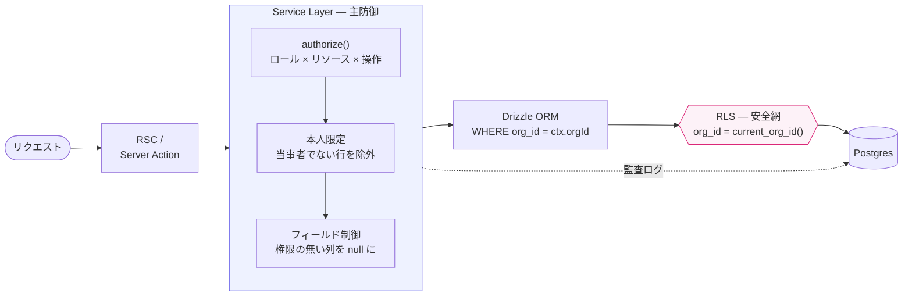

<div align="center">

# FondraHR

**マルチテナント型タレントマネジメント SaaS**

従業員情報・スキル・1on1記録・評価を一元管理する。<br>
テナント分離と認可設計の堅牢さに重心を置いた個人開発プロジェクト。

[](https://github.com/TakuyaMiyashita/fondra-hr/actions/workflows/ci.yml)
[](#ライセンス)

**[デモ環境](https://fondra-hr-staging.vercel.app)** ・ [設計ドキュメント](./docs/)

</div>


## アーキテクチャ

SaaS で壊してはいけないのは、他社のデータが見えることと、権限を越えた操作ができることの2つ。
機能の数ではなく、この2点をどう設計し、壊れていないことをどう示すかに時間を使っている。

テナント分離は二重に持つ。Service Layer の `WHERE org_id` と RLS のどちらか一方が漏れても
データは守られる。ただし RLS に持たせるのは `org_id` の一致だけにしている。
複雑な条件を SQL に書くと、壊れたときに気付けない。



→ [テナント分離](./docs/architecture/multi-tenancy.md) ／ [レイヤードアーキテクチャ](./docs/architecture/layered-architecture.md)

### 認可の3段階

| 段階                 | 何を絞るか               | 例                                                |
| -------------------- | ------------------------ | ------------------------------------------------- |
| `authorize()`        | ロール × リソース × 操作 | viewer は書き込み不可、削除は admin 以上          |
| 本人限定（行）       | 当事者でないレコード     | member は自分が当事者の 1on1 だけ閲覧・編集できる |
| フィールド制御（列） | 権限の無いカラム         | 生年月日は admin 以上と本人のみ。他は null で返る |

「本人」の判定はログインユーザーと従業員レコードの紐付け（`employees.user_id`）で行い、
未紐付けは「何も見えない」に倒している。ここを「チェック不要」と解釈すると、
紐付け前のユーザーに全社のデータが開く。

→ [認可マトリクス](./docs/database/authorization-matrix.md) ／ [認証・認可モデル](./docs/architecture/auth-and-authorization.md)

## デモ環境

**<https://fondra-hr-staging.vercel.app>** にデモ組織「株式会社フォンドラ」
（従業員30名 / 部署12件 / 1on1 108件 / 評価2サイクル）を用意している。
同じ画面を別のロールで開くと、認可の効き方がそのまま見える。

| メールアドレス               | ロール | 見え方                                            |
| ---------------------------- | ------ | ------------------------------------------------- |
| `owner@fondra.example.com`   | owner  | 全データ                                          |
| `hr@fondra.example.com`      | admin  | 全データ（組織削除を除く）                        |
| `manager@fondra.example.com` | member | 生年月日が「—」になり、他人の1on1が一覧から消える |

パスワードは全て `demo-password123`。自由に触ってよい。書き込みも削除もできるので、
データが荒れていたら作り直している最中かもしれない。

## 動かす

Node.js 22 / pnpm 9+ / Docker が必要。

```bash
pnpm install
cp .env.example .env.local

npx supabase start      # ローカル Supabase 起動
npx supabase db reset   # マイグレーション適用 + デモデータ投入

pnpm dev
```

`db reset` で入るのはデモ環境と同じデータ。日付は実行日からの相対で生成されるため、
いつ reset しても「直近90日の1on1」「進行中の評価サイクル」が成立する。

### テスト

unit 1456件 / e2e 131件。カバレッジは statements / functions / lines 100%、branches 99% を
閾値として CI で強制している。

```bash
pnpm test:coverage      # unit + カバレッジ（DB 不要）
pnpm check:conventions  # 規約の機械検査（DB 不要）
pnpm test:e2e           # Playwright（ローカル Supabase 必要）
```

e2e は owner / member / viewer の3セッションで同じ画面を開き、member に見えてはいけない値が
ページのどこにも無いことを確認する。このとき owner では見えることも併せて確認している。
片方だけだと、データが無いだけでテストが通る。

→ [テスト戦略](./docs/testing.md)

<details>
<summary><b>画面</b></summary>

<table>
<tr>
<td width="50%"></td>
<td width="50%"></td>
</tr>
<tr>
<td align="center"><sub>従業員一覧 — 検索・絞り込みは URL 状態</sub></td>
<td align="center"><sub>組織図 — ドラッグ&amp;ドロップで階層を編集</sub></td>
</tr>
<tr>
<td width="50%"></td>
<td width="50%"></td>
</tr>
<tr>
<td align="center"><sub>スキルマトリクス</sub></td>
<td></td>
</tr>
</table>

`node scripts/capture-screenshots.mjs` で撮り直せる。

</details>

## 技術スタック

Next.js 16（App Router / RSC）・TypeScript strict・Supabase（Postgres + Auth + Storage + RLS）・
Drizzle ORM・Tailwind CSS + shadcn/ui・TanStack Table / Query・nuqs・Recharts・
React Hook Form + Zod・Vercel AI SDK・Vitest + Testing Library + Playwright

DB アクセスは Drizzle に一本化し、Supabase JS Client は Auth と Storage にだけ使っている。

## ドキュメント

実装コードだけでなく設計書も成果物として [`docs/`](./docs/) に置いている。

|                                                                                        |                                                    |
| -------------------------------------------------------------------------------------- | -------------------------------------------------- |
| [システム全体像](./docs/architecture/system-overview.md)                               | 構成と責務の分担                                   |
| [レイヤードアーキテクチャ](./docs/architecture/layered-architecture.md)                | 層の切り方と依存の向き                             |
| [テナント分離](./docs/architecture/multi-tenancy.md)                                   | 二重防御の設計                                     |
| [認証・認可モデル](./docs/architecture/auth-and-authorization.md)                      | JWT フック・組織切替・メール確認・3段階の認可      |
| [認可マトリクス](./docs/database/authorization-matrix.md)                              | ロール × リソース × 操作の一覧                     |
| [Service Layer API](./docs/api/service-layer.md)                                       | 各サービスのメソッドと認可                         |
| [ER図](./docs/database/er-diagram.md) ／ [RLS ポリシー](./docs/database/rls-policy.md) | データモデルとポリシー定義                         |
| [ユーザーフロー](./docs/design/user-flows.md)                                          | サインアップ・招待・1on1・評価のフロー図           |
| [画面一覧](./docs/design/screen-inventory.md)                                          | 全画面の状態定義（通常・ローディング・空・エラー） |
| [UI ガイドライン](./docs/design/ui-guidelines.md)                                      | 画面構成・空状態・エラー表示                       |
| [テスト戦略](./docs/testing.md)                                                        | 3つの project・カバレッジ方針・ロール別 e2e        |
| [ADR](./docs/adr/README.md)                                                            | 設計判断の記録と、捨てた案の理由                   |
| [デプロイ手順](./docs/deployment.md)                                                   | Vercel + Supabase Cloud                            |

運用しているのは検証環境ひとつだけ。実ユーザーがいないので分ける利点が無い。

## ライセンス

MIT
