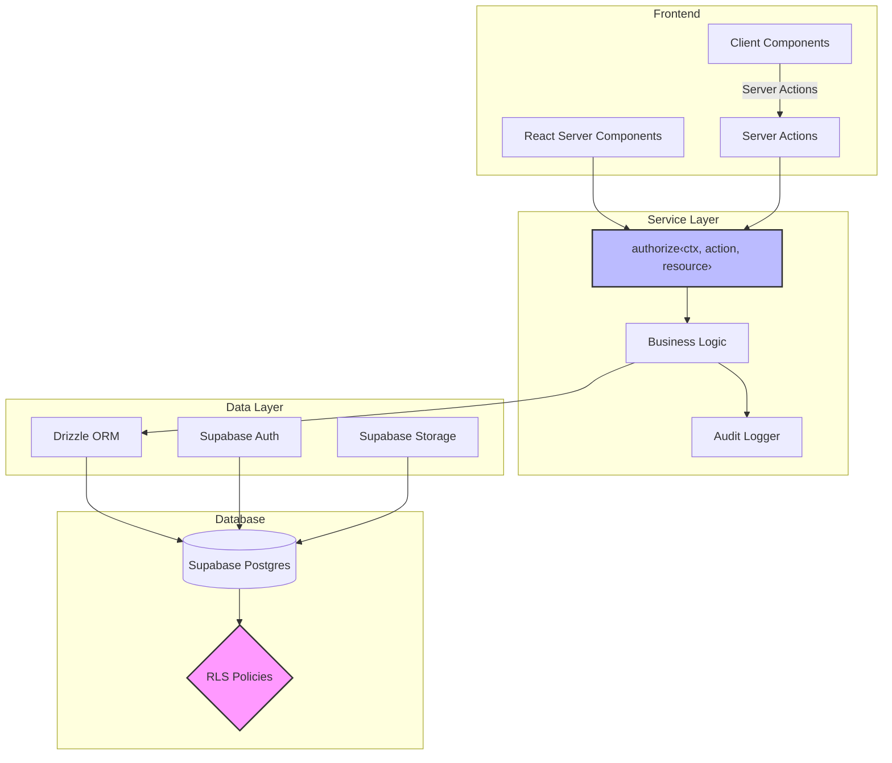

# TalentPulse

マルチテナント型タレントマネジメントSaaS。従業員情報・スキル・1on1記録・評価を一元管理する。

## アーキテクチャ



### テナント分離の防御多層化

| レイヤー | 役割 | 仕組み |
|----------|------|--------|
| Service Layer | 主防御 | 全クエリに `WHERE org_id = ctx.orgId` を付与 |
| RLS | 安全網 | `org_id` の単純チェック。どちらかが漏れてもデータは守られる |

## 技術スタック

| カテゴリ | 技術 |
|----------|------|
| フレームワーク | Next.js 16 (App Router, RSC) |
| 言語 | TypeScript (strict) |
| DB / BaaS | Supabase (Postgres + Auth + Storage + RLS) |
| ORM | Drizzle ORM |
| UI | Tailwind CSS + shadcn/ui |
| データグリッド | TanStack Table |
| データ取得 | TanStack Query |
| 可視化 | Recharts |
| フォーム | React Hook Form + Zod |
| AI | Vercel AI SDK |
| テスト | Vitest + Testing Library + Playwright (e2e) |

## セットアップ

### 前提条件

- Node.js 20+
- pnpm 9+
- Docker（Supabase ローカル実行用）

### 手順

```bash
# 1. 依存のインストール
pnpm install

# 2. 環境変数の設定
cp .env.example .env.local

# 3. Supabase ローカル起動
npx supabase start

# 4. マイグレーション適用
npx supabase db reset

# 5. 開発サーバー起動
pnpm dev
```

### npm scripts

| コマンド | 説明 |
|----------|------|
| `pnpm dev` | 開発サーバー起動 |
| `pnpm build` | プロダクションビルド |
| `pnpm lint` | ESLint 実行 |
| `pnpm typecheck` | TypeScript 型チェック |
| `pnpm test` | ユニットテスト実行 |
| `pnpm test:e2e` | E2Eテスト実行 (Playwright) |
| `pnpm test:rls` | RLSテスト実行 |
| `pnpm format` | Prettier フォーマット |
| `pnpm format:check` | フォーマットチェック |
| `pnpm db:generate` | Drizzle マイグレーション生成 |
| `pnpm db:migrate` | マイグレーション適用 |
| `pnpm db:studio` | Drizzle Studio 起動 |

## 設計ドキュメント

詳細な設計書は [`docs/`](./docs/) を参照。

- [システム全体のアーキテクチャ](./docs/architecture/system-overview.md)
- [テナント分離の防御多層化](./docs/architecture/multi-tenancy.md)
- [認証・認可モデル](./docs/architecture/auth-and-authorization.md)
- [ER図](./docs/database/er-diagram.md)
- [UIデザインガイドライン](./docs/design/ui-guidelines.md)

## ライセンス

MIT
