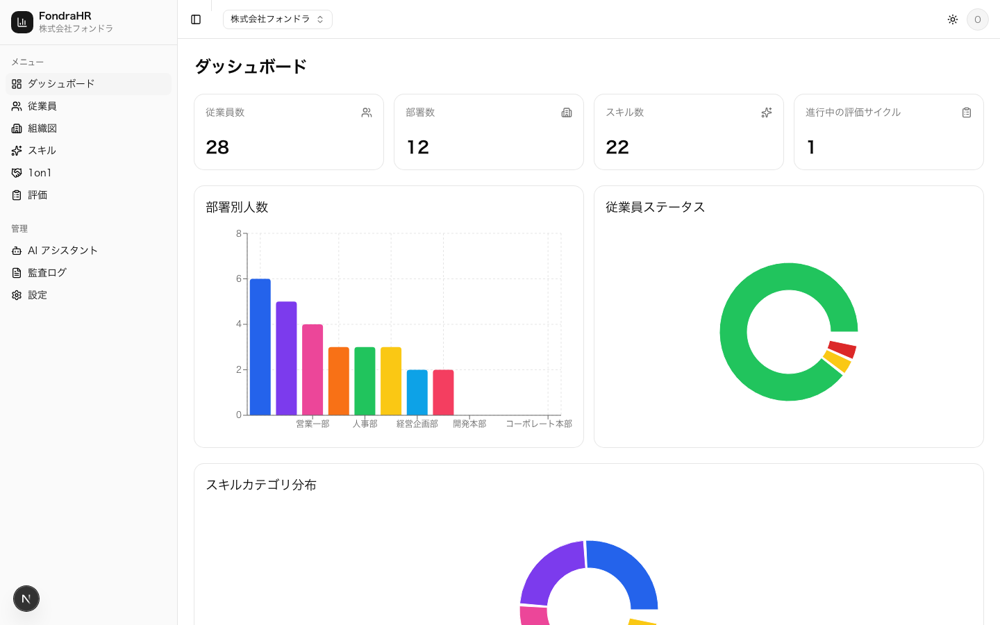
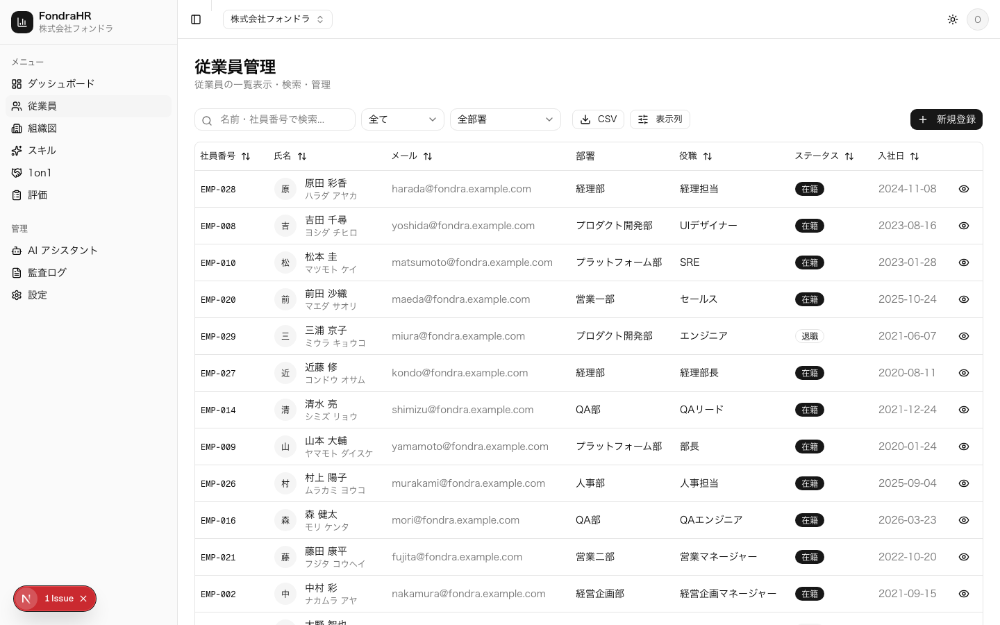
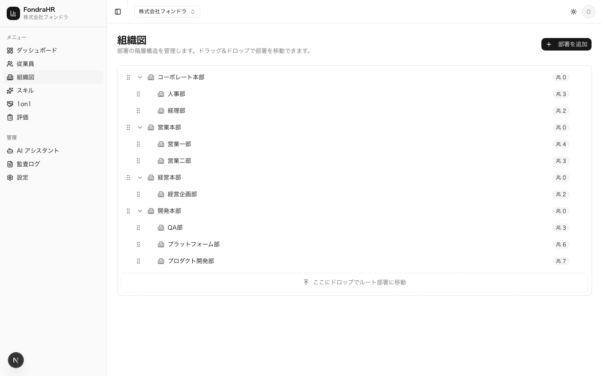
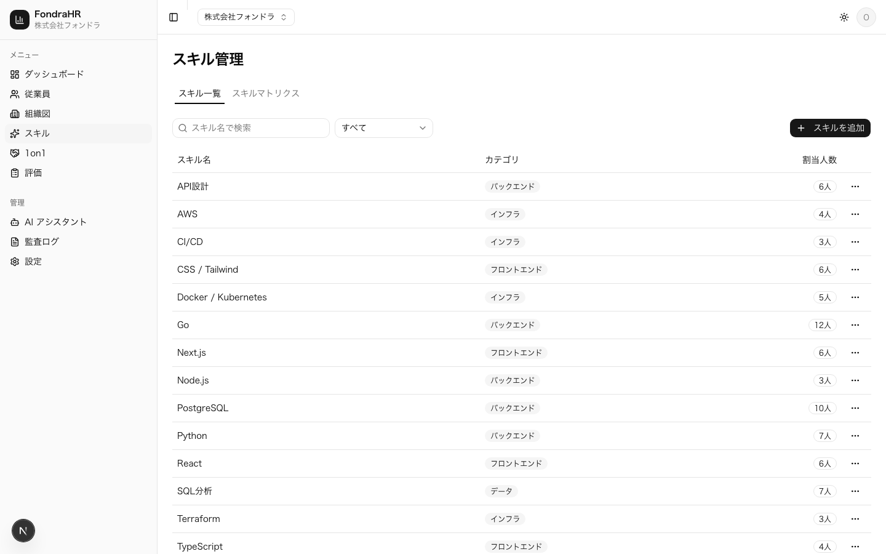

<div align="center">

# FondraHR

**マルチテナント型タレントマネジメント SaaS**

従業員情報・スキル・1on1記録・評価を一元管理する。<br>
テナント分離と認可設計の堅牢さを主題に据えた個人開発プロジェクト。

[](https://github.com/TakuyaMiyashita/fondra-hr/actions/workflows/ci.yml)
[](#ライセンス)


**[デモ環境](https://fondra-hr-staging.vercel.app)** ・ [設計ドキュメント](./docs/)

</div>



## 主題

SaaS で壊してはいけないのは、**他社のデータが見えること**と**権限を越えた操作ができること**の2つ。
機能の数ではなく、この2点をどう設計し、壊れていないことをどう示すかに時間を使っている。

- **テナント分離は二重に持つ** — Service Layer の `WHERE org_id` と RLS。
  どちらか一方が漏れてもデータは守られる
- **認可はロール表だけでは足りない** — 「自分が当事者のデータだけ」「確定後だけ本人に開示」
  といった制御を、行単位・列単位の2段階で追加している
- **「見えないこと」は対照群とセットで検証する** — 同じ値が owner では見えることを
  確認しないと、データが無いだけで検証が素通りする

## アーキテクチャ


RSC / Server Action から直接 Drizzle を呼ばない。必ず Service Layer を経由し、
`authorize()` → DB操作 → 監査ログの順で処理する。DB アクセスは Drizzle に一本化し、
Supabase JS Client は Auth と Storage にのみ使う。

RLS には `org_id` の単純チェックしか持たせない。複雑な条件を SQL で書くと壊れたときに
気付けないため、ロール別の制御は TypeScript 側に寄せている。

### 認可の3段階

| 段階                 | 何を絞るか               | 例                                                |
| -------------------- | ------------------------ | ------------------------------------------------- |
| `authorize()`        | ロール × リソース × 操作 | viewer は書き込み不可、削除は admin 以上          |
| 本人限定（行）       | 当事者でないレコード     | member は自分が当事者の 1on1 だけ閲覧・編集できる |
| フィールド制御（列） | 権限の無いカラム         | 生年月日は admin 以上と本人のみ。他は null で返る |

「本人」の判定はログインユーザーと従業員レコードの紐付け（`employees.user_id`）で行い、
**未紐付けは「何も見えない」に倒す**。ここを「チェック不要」と解釈すると、
紐付け前のユーザーに全社のデータが開く。

→ [認可マトリクス](./docs/database/authorization-matrix.md) ／ [認証・認可モデル](./docs/architecture/auth-and-authorization.md)

## 動かす

Node.js 22 / pnpm 9+ / Docker が必要。

```bash
pnpm install
cp .env.example .env.local

npx supabase start      # ローカル Supabase 起動
npx supabase db reset   # マイグレーション適用 + デモデータ投入

pnpm dev
```

### ロールを切り替えて認可を見る

デモ組織「株式会社フォンドラ」（従業員30名 / 部署12件 / 1on1 108件 / 評価2サイクル）が
投入される。**同じ画面を別のロールで開くと、認可の効き方がそのまま見える。**

| メールアドレス               | ロール | 見え方                                            |
| ---------------------------- | ------ | ------------------------------------------------- |
| `owner@fondra.example.com`   | owner  | 全データ                                          |
| `hr@fondra.example.com`      | admin  | 全データ（組織削除を除く）                        |
| `manager@fondra.example.com` | member | 生年月日が「—」になり、他人の1on1が一覧から消える |

パスワードは全て `demo-password123`。日付は実行日からの相対で生成されるため、
いつ reset しても「直近90日の1on1」「進行中の評価サイクル」が成立する。

### テスト

```bash
pnpm test:coverage   # unit + カバレッジ（DB 不要）
pnpm test:e2e        # Playwright（ローカル Supabase 必要）
```

unit 1400件超・e2e 89件。カバレッジは statements / functions / lines 100%、branches 99% を
閾値として CI で強制している。e2e は owner / member / viewer の3セッションを用意し、
機微な値がページのどこにも現れないことを検証する。

→ [テスト戦略](./docs/testing.md)

<details>
<summary><b>画面</b></summary>

<table>
<tr>
<td width="50%"></td>
<td width="50%"></td>
</tr>
<tr>
<td align="center"><sub>従業員一覧 — 検索・絞り込みは URL 状態</sub></td>
<td align="center"><sub>組織図 — ドラッグ&amp;ドロップで階層を編集</sub></td>
</tr>
<tr>
<td width="50%"></td>
<td width="50%"></td>
</tr>
<tr>
<td align="center"><sub>スキルマトリクス</sub></td>
<td></td>
</tr>
</table>

`node scripts/capture-screenshots.mjs` で撮り直せる。

</details>

## 技術スタック

Next.js 16（App Router / RSC）・TypeScript strict・Supabase（Postgres + Auth + Storage + RLS）・
Drizzle ORM・Tailwind CSS + shadcn/ui・TanStack Table / Query・nuqs・Recharts・
React Hook Form + Zod・Vercel AI SDK・Vitest + Testing Library + Playwright

## ドキュメント

実装コードだけでなく設計書も成果物として [`docs/`](./docs/) に置いている。

|                                                                                        |                                               |
| -------------------------------------------------------------------------------------- | --------------------------------------------- |
| [システム全体像](./docs/architecture/system-overview.md)                               | 構成と責務の分担                              |
| [レイヤードアーキテクチャ](./docs/architecture/layered-architecture.md)                | 層の切り方と依存の向き                        |
| [テナント分離](./docs/architecture/multi-tenancy.md)                                   | 二重防御の設計                                |
| [認証・認可モデル](./docs/architecture/auth-and-authorization.md)                      | JWT フック・組織切替・メール確認・3段階の認可 |
| [認可マトリクス](./docs/database/authorization-matrix.md)                              | ロール × リソース × 操作の一覧                |
| [Service Layer API](./docs/api/service-layer.md)                                       | 各サービスのメソッドと認可                    |
| [ER図](./docs/database/er-diagram.md) ／ [RLS ポリシー](./docs/database/rls-policy.md) | データモデルとポリシー定義                    |
| [テスト戦略](./docs/testing.md)                                                        | 3つの project・カバレッジ方針・ロール別 e2e   |
| [UI ガイドライン](./docs/design/ui-guidelines.md)                                      | 画面構成・空状態・エラー表示                  |
| [デプロイ手順](./docs/deployment.md)                                                   | Vercel + Supabase Cloud                       |

運用しているのは検証環境ひとつのみ。実ユーザーを持たないため環境を分ける利点が無いという判断で、
本番運用する場合に何を変えるべきかはデプロイ手順に併記している。

## ライセンス

MIT
