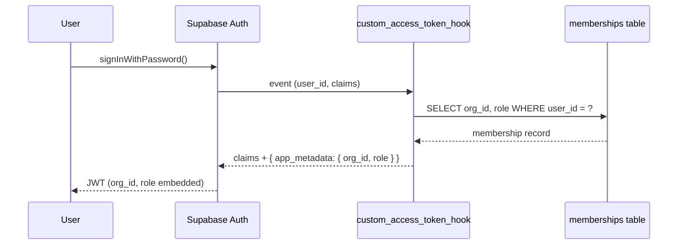
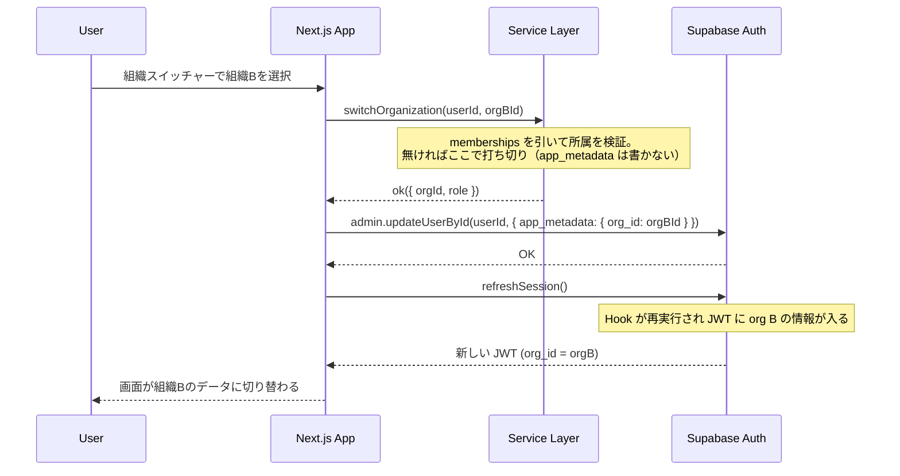
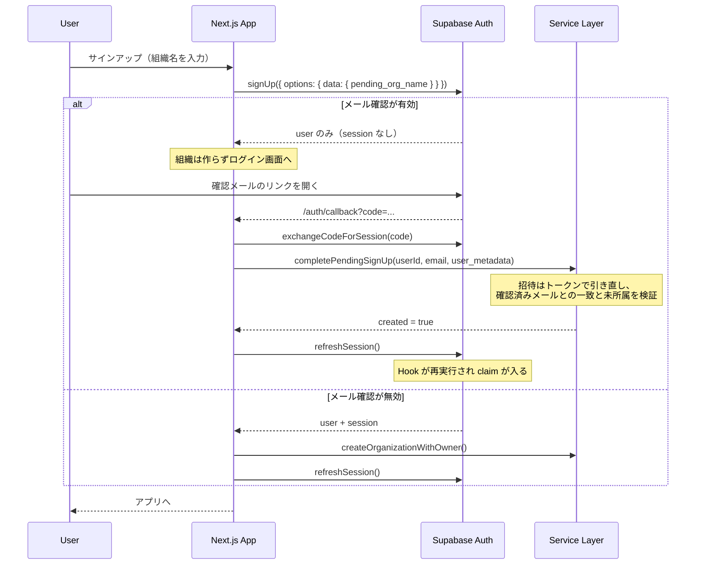

# 認証・認可モデルの設計

## 認証（Authentication）

Supabase Auth を使用。メール + パスワードによる認証を基本とする。

### Custom Access Token Hook

JWT 発行時に PL/pgSQL 関数 `auth.custom_access_token_hook` が呼ばれ、`app_metadata` にテナント情報を埋め込む。



### Hook のロジック

1. JWT の `app_metadata.org_id` を確認
2. 値がある場合 → `memberships` でその組織のメンバーシップが存在するか検証
3. メンバーシップが無効（削除済み等）なら → 最初のメンバーシップにフォールバック
4. メンバーシップが一切ない → `org_id` と `role` を null に設定

### 組織切替フロー



#### app_metadata の書き込みに service_role が要る理由

Hook が読むのは `app_metadata` だが、この領域はクライアント（anon キー）からは
書き換えられない。ユーザーが自分で `org_id` を書けたら、所属していない組織の
JWT を自分で発行できてしまうためで、これは意図的な設計。したがって組織切替は
service_role の Auth Admin API（`auth.admin.updateUserById`）を通す。

`supabase.auth.updateUser({ data })` が書くのは `user_metadata` であり、
Hook はこれを読まない。ここに `org_id` を書いても組織は切り替わらない。

service_role は RLS を丸ごとバイパスするため、**Server Action 側で
`switchOrganization()` によるメンバーシップ検証を通してから**呼ぶ。
検証を挟まないとクライアント指定の `orgId` がそのままクレームになり、
権限昇格になる。JWT Hook 側の再検証（上記ロジックの 2〜3）は最後の安全網であって、
アプリ側の検証を省略してよい理由にはならない。

### メール確認と保留サインアップ

メール確認（`enable_confirmations`）を有効にすると `signUp()` はセッションを
返さない。その状態で組織・メンバーシップを作ると、確認されなかった登録の
ぶんだけ**誰も入れない組織**が残り、招待経路では `accepted_at` だけが立って
**招待が消費される**。そのため作成内容を `user_metadata` に預け、確認後に消化する。



どちらの設定でも動く。`refreshSession()` を省くと、メンバーシップ作成前の
JWT（`app_metadata.org_id` が null）のまま画面に入り、リダイレクトループになる。

**確認メールのリンク先は redirect 許可リストに載せる必要がある。**
許可リストに無い `redirect_to` は**エラーにならず `site_url` に差し替えられる**
ため、載せ忘れると `/auth/callback` を通らず保留分が消化されない。

## 認可（Authorization）

### ロール定義

| ロール   | 説明                                          |
| -------- | --------------------------------------------- |
| `owner`  | 組織の作成者。全権限                          |
| `admin`  | 管理者。owner と同等の権限（組織削除を除く）  |
| `member` | 一般メンバー。参照 + 自分に紐づくデータの編集 |
| `viewer` | 閲覧のみ。デモログイン用途                    |

### RLS と Service Layer の二層防御

```
リクエスト
  ↓
[Service Layer] authorize(ctx, action, resource) → ロール別の権限チェック
  ↓
[Service Layer] WHERE org_id = ctx.orgId → テナント外を除外
  ↓
データアクセス
```

- **Service Layer（唯一の防御）**: ロール × リソース × 操作の認可マトリクスと
  テナント分離の両方を TypeScript で実装する
- **RLS**: ポリシーは全テーブルに定義してあるが、**アプリ経路では評価されない**。
  Drizzle がテーブル所有者として接続するため。効くのは Data API 経由だけで、
  そちらは権限を剥がして閉じてある

以前この節は「RLS が Service Layer の手前で遮断する」「どちらか一方が漏れても
データは守られる」と書いていたが、どちらも事実ではなかった。
経緯は [ADR 0011](../adr/0011-data-api-is-closed.md)。

### Service Layer 内部の3段階

ロール × リソースの表だけでは表現できない制御が2種類あり、Service Layer は
authorize() の後にさらに2段階の絞り込みを行う。

**本人限定（行単位）** — member は自分が当事者の 1on1・自分が評価者の評価だけを
作成・編集でき、1on1 は閲覧も同じ範囲に絞る。判定はログインユーザーと従業員
レコードの紐付け（`employees.user_id`）で行う。未紐付けは「何も見えない・
何もできない」に倒す。

**フィールド単位（列単位）** — 従業員・評価サイクルの read は全ロールに
開いているため、行単位では機微な列を守れない。生年月日と評価コメントは
読み取り時に null へ潰す。

```
[Service Layer] authorize()   → ロール × リソース × 操作
  ↓
[Service Layer] 本人限定       → 当事者でない「行」を除外
  ↓
[Service Layer] フィールド制御 → 権限の無い「列」を null に潰す
```

実装は `src/services/self.ts` と `src/services/field-visibility.ts`。
詳細は [`docs/api/service-layer.md`](../api/service-layer.md)。

### 認可マトリクス

詳細は [`docs/database/authorization-matrix.md`](../database/authorization-matrix.md) を参照。

## セッション管理

- JWT 有効期限: 1時間（`config.toml` の `jwt_expiry = 3600`）
- リフレッシュトークンローテーション有効
- `src/proxy.ts` で全リクエスト時にセッション更新（Next.js 16 で `middleware.ts` から改名）
- 未認証ユーザーは `/login` にリダイレクト
