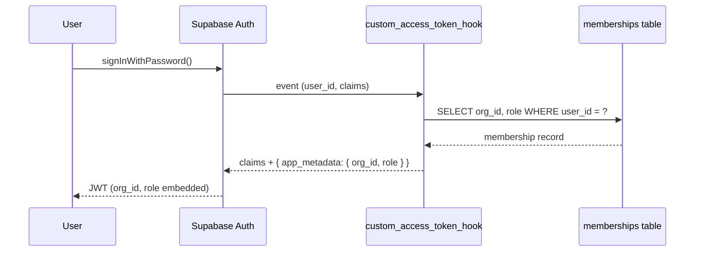
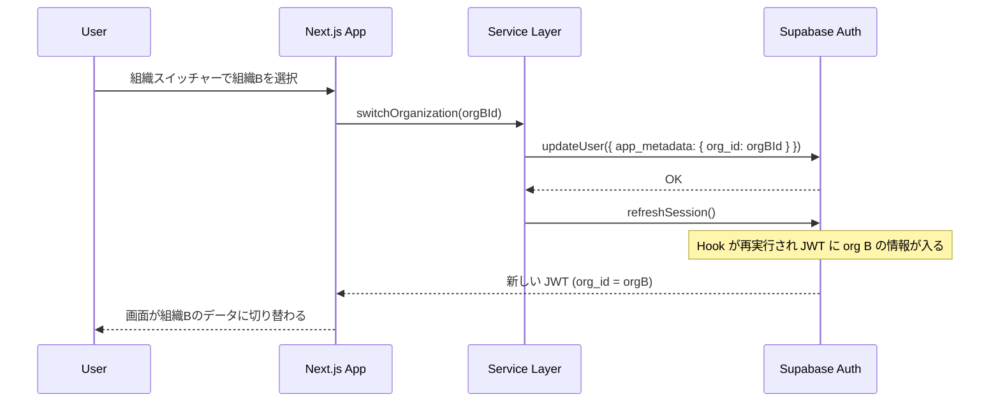

# 認証・認可モデルの設計

## 認証（Authentication）

Supabase Auth を使用。メール + パスワードによる認証を基本とする。

### Custom Access Token Hook

JWT 発行時に PL/pgSQL 関数 `auth.custom_access_token_hook` が呼ばれ、`app_metadata` にテナント情報を埋め込む。



### Hook のロジック

1. JWT の `app_metadata.org_id` を確認
2. 値がある場合 → `memberships` でその組織のメンバーシップが存在するか検証
3. メンバーシップが無効（削除済み等）なら → 最初のメンバーシップにフォールバック
4. メンバーシップが一切ない → `org_id` と `role` を null に設定

### 組織切替フロー



## 認可（Authorization）

### ロール定義

| ロール   | 説明                                          |
| -------- | --------------------------------------------- |
| `owner`  | 組織の作成者。全権限                          |
| `admin`  | 管理者。owner と同等の権限（組織削除を除く）  |
| `member` | 一般メンバー。参照 + 自分に紐づくデータの編集 |
| `viewer` | 閲覧のみ。デモログイン用途                    |

### 認可の二層構造

```
リクエスト
  ↓
[RLS] org_id チェック → テナント外のデータを完全遮断
  ↓
[Service Layer] authorize(ctx, action, resource) → ロール別の細かな権限チェック
  ↓
データアクセス
```

- **RLS（安全網）**: `org_id = current_org_id()` のみ。シンプルで壊れにくい
- **Service Layer（主）**: ロール × リソース × 操作の認可マトリクスを TypeScript で実装

どちらか一方が漏れてもデータは守られる。

### 認可マトリクス

詳細は [`docs/database/authorization-matrix.md`](../database/authorization-matrix.md) を参照。

## セッション管理

- JWT 有効期限: 1時間（`config.toml` の `jwt_expiry = 3600`）
- リフレッシュトークンローテーション有効
- `middleware.ts` で全リクエスト時にセッション更新
- 未認証ユーザーは `/login` にリダイレクト
