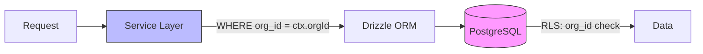

# テナント分離の防御多層化設計

> Phase 1A/1B で実装時に詳細を追記する。

## 設計方針

テナント間のデータ漏洩を防ぐため、**2つのレイヤーで独立にテナント分離を保証**する。

### Layer 1: Service Layer（主防御）

- 全クエリに `WHERE org_id = ctx.orgId` を自動付与
- `ctx.orgId` は JWT Custom Claims から取得した値のみ使用
- Service Layer を経由しない DB アクセスは禁止

### Layer 2: RLS（安全網）

- 全テーブルで RLS を有効化
- ポリシーは `org_id = current_setting('app.current_org_id')` のシンプルなチェックのみ
- ロール別の制御はRLSに持たせない（Service Layer で担当）

### なぜ二重にするのか

- Service Layer だけに頼ると、新しいクエリで `org_id` フィルタを付け忘れた場合にデータ漏洩
- RLS だけに頼ると、ポリシーの設定漏れ・複雑なポリシーのバグでデータ漏洩
- 二重にすることで、片方が漏れてももう片方がカバーする
