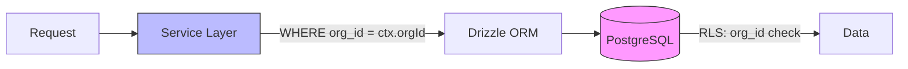

# テナント分離の防御多層化設計

## 設計方針

テナント間のデータ漏洩を防ぐため、**2つのレイヤーで独立にテナント分離を保証**する。



### Layer 1: Service Layer（主防御）

- 全クエリに `WHERE org_id = ctx.orgId` を自動付与
- `ctx.orgId` は JWT Custom Claims から取得した値のみ使用
- Service Layer を経由しない DB アクセスは禁止

### Layer 2: RLS（安全網）

- 全テーブルで RLS を有効化
- ポリシーは `org_id = current_org_id()` のシンプルなチェックのみ
- `current_org_id()` は JWT の `app_metadata.org_id` から取得
- ロール別の制御はRLSに持たせない（Service Layer で担当）

### なぜ二重にするのか

- Service Layer だけに頼ると、新しいクエリで `org_id` フィルタを付け忘れた場合にデータ漏洩
- RLS だけに頼ると、ポリシーの設定漏れ・複雑なポリシーのバグでデータ漏洩
- 二重にすることで、片方が漏れてももう片方がカバーする

## org_id の強制

全テーブルに `org_id uuid not null` を持たせる。`evaluations` のように親テーブル（`evaluation_cycles`）経由で `org_id` を辿れるテーブルでも、直接 `org_id` を持つ。理由:

1. RLS ポリシーが全テーブルで同一パターン（`org_id = current_org_id()`）になり、設定漏れを防げる
2. JOIN なしでテナント判定できるため、パフォーマンスが予測しやすい

## 対象テーブル一覧

| テーブル          | org_id         | RLS | 備考                    |
| ----------------- | -------------- | --- | ----------------------- |
| organizations     | `id` が org_id | Yes | `id = current_org_id()` |
| memberships       | Yes            | Yes |                         |
| invitations       | Yes            | Yes |                         |
| departments       | Yes            | Yes |                         |
| employees         | Yes            | Yes |                         |
| skills            | Yes            | Yes |                         |
| employee_skills   | Yes            | Yes |                         |
| one_on_ones       | Yes            | Yes |                         |
| evaluation_cycles | Yes            | Yes |                         |
| evaluations       | Yes            | Yes |                         |
| audit_logs        | Yes            | Yes | SELECT + INSERT のみ    |

## 監査ログの不変性

`audit_logs` は DB レベルで UPDATE/DELETE を禁止する:

- BEFORE UPDATE / BEFORE DELETE トリガーで例外を発生
- `authenticated` ロールには SELECT + INSERT のみ GRANT
- service_role でも UPDATE/DELETE はトリガーでブロックされる

### 例外: 組織のパージ

`audit_logs.org_id` は `organizations` を `ON DELETE CASCADE` で参照している。
不変性を無条件に適用すると、監査ログを1件でも持つ組織はカスケード削除が
トリガーに拒否され、**永久に削除できなくなる**（解約顧客のデータ削除が不可能になる）。

そのため、明示的なパージ操作のときだけ削除を通す経路を用意している。

| 操作                             | 通常時   | パージ中                                 |
| -------------------------------- | -------- | ---------------------------------------- |
| `audit_logs` の UPDATE           | 拒否     | **拒否**（書き換えは常に認めない）       |
| `audit_logs` の DELETE           | 拒否     | 許可                                     |
| ドメインテーブル変更時の監査記録 | 記録する | 記録しない（記録先の組織ごと消えるため） |

```sql
-- 組織とその全関連データ（監査ログ含む）を削除する唯一の経路
select public.purge_organization('<org_id>');
```

- パージ中かどうかは `app.audit_log_purge` というトランザクションローカルな設定で判定する。
  `purge_organization()` の実行トランザクションを抜けた時点で自動的に元へ戻るため、
  フラグが立ちっぱなしになることはない
- `purge_organization()` は `service_role` にのみ EXECUTE を GRANT している。
  そもそも `authenticated` には `organizations` / `audit_logs` の DELETE 権限も
  削除を許す RLS ポリシーも無いため、アプリのエンドユーザーからは到達できない
