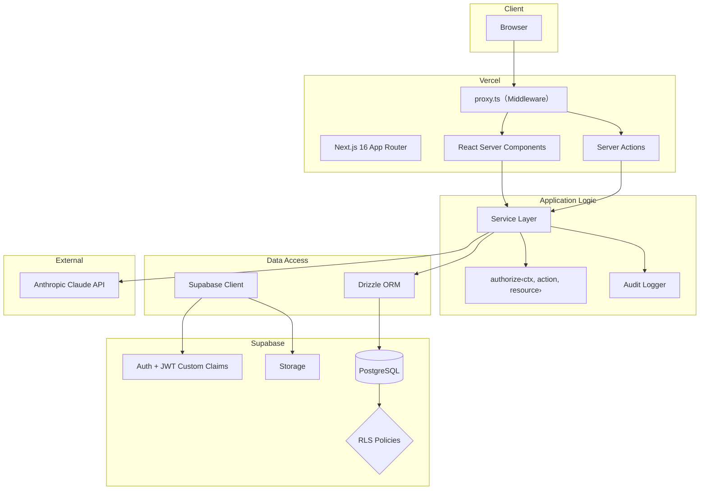

# システムアーキテクチャ概要

## 全体構成

## 技術選定の根拠

### Next.js 16 App Router + RSC

- Server Components による初回レンダリングの高速化とバンドルサイズ削減
- Server Actions によるサーバーサイドミューテーションの型安全な実装
- Route Groups による認証状態に基づくレイアウト分離

### Supabase

- PostgreSQL + RLS によるデータベースレベルでのセキュリティ
- Auth による認証基盤（JWT Custom Claims でテナント情報を埋め込み）
- Storage によるテナント分離されたファイル管理
- ローカル開発環境の充実（Docker ベース）
- Free Tier でポートフォリオ運用可能

### Drizzle ORM

- TypeScript ファーストの型安全なクエリビルダ
- Supabase JS Client と比較して複雑な JOIN / 集計が自然に書ける
- スキーマ定義が型のソースとなり、`supabase gen types` が不要
- Edge Runtime 対応

### Service Layer パターン

- 認可・ビジネスロジック・監査ログを一貫した場所に集約
- テナント分離を Application Level で保証（**RLS はアプリ経路では効かない** → [ADR 0011](../adr/0011-data-api-is-closed.md)）
- テスト容易性：Service Layer 単体でユニットテスト可能

### TanStack Query + nuqs

- TanStack Query: クライアントサイドのキャッシュ・バックグラウンド更新・楽観的更新
- nuqs: フィルタ・ソート・ページネーション状態を URL に永続化（共有可能・ブラウザバック対応）

## レイヤー別の責務

| レイヤー      | 責務                                          | 配置                   |
| ------------- | --------------------------------------------- | ---------------------- |
| App Router    | ルーティング・レイアウト・データ取得の起点    | `src/app/`             |
| Components    | UI表示・ユーザーインタラクション              | `src/components/`      |
| Service Layer | 認可チェック・ビジネスロジック・監査ログ記録  | `src/services/`        |
| Drizzle ORM   | 型安全なDBクエリ・org_id フィルタ付与         | `src/db/`              |
| RLS           | Data API 経由のみ有効。アプリ経路では効かない | `supabase/migrations/` |
