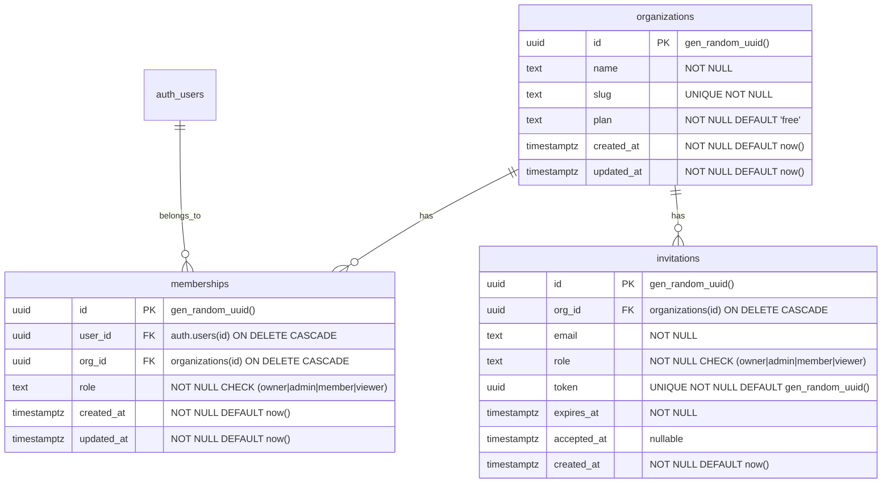

# ER図

## テナント基盤（Phase 1A）

### インデックス

| テーブル | カラム | 種別 | 用途 |
|----------|--------|------|------|
| `memberships` | `(user_id, org_id)` | UNIQUE | ユーザーは1組織に1メンバーシップ |
| `memberships` | `(org_id)` | INDEX | テナント内メンバー一覧 |
| `memberships` | `(user_id)` | INDEX | ユーザーの所属組織一覧 |
| `invitations` | `(org_id, email)` | INDEX | 重複招待チェック |
| `invitations` | `(token)` | UNIQUE | トークン検索（UNIQUE制約で自動） |

## 業務ドメイン（Phase 1B）

> Phase 1B 開始時に追記する。
