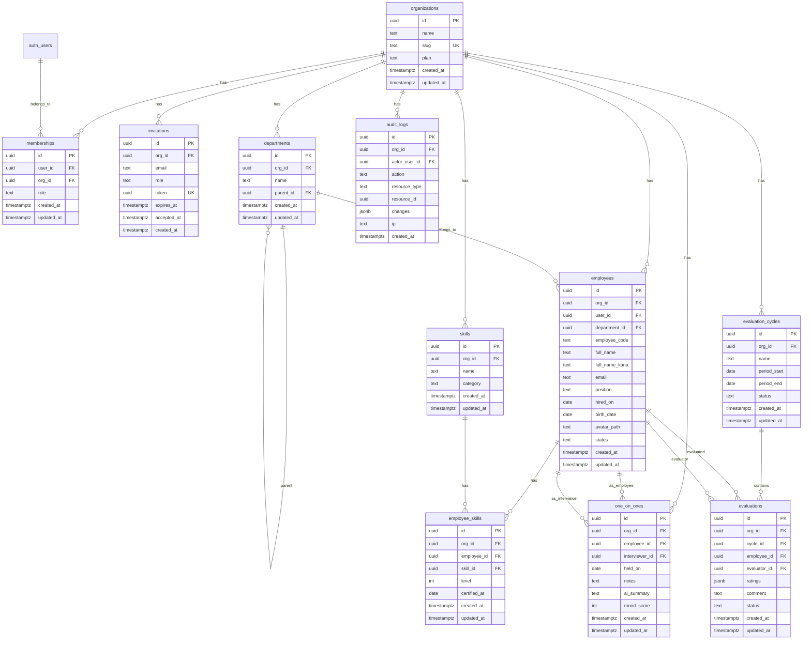

# ER図

## 全体図（Phase 1A + 1B）

## ユニーク制約

| テーブル | カラム | 用途 |
|----------|--------|------|
| `memberships` | `(user_id, org_id)` | ユーザーは1組織に1メンバーシップ |
| `employees` | `(org_id, employee_code)` | 組織内で社員番号は一意 |
| `skills` | `(org_id, name)` | 組織内でスキル名は一意 |
| `employee_skills` | `(employee_id, skill_id)` | 1人1スキルにつき1レコード |

## ビュー

### employee_risk_scores

`security_invoker = true` で RLS がビュー経由でも適用される。

4軸スコア（各0-25点、合計0-100点）:
- **在籍期間**: 短いほど高リスク
- **1on1頻度**: 直近3ヶ月の回数が少ないほど高リスク
- **mood推移**: 直近3回の平均が低いほど高リスク
- **スキル変化**: 直近の更新が古いほど高リスク

リスクレベル: 0-33 = low, 34-66 = medium, 67-100 = high
