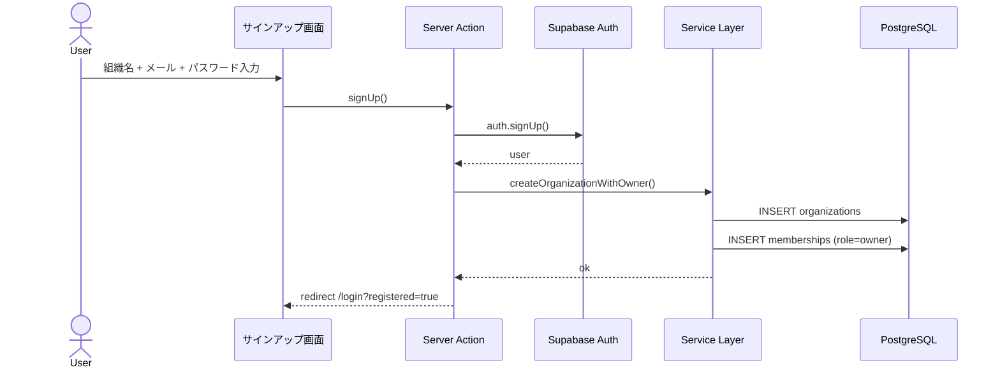
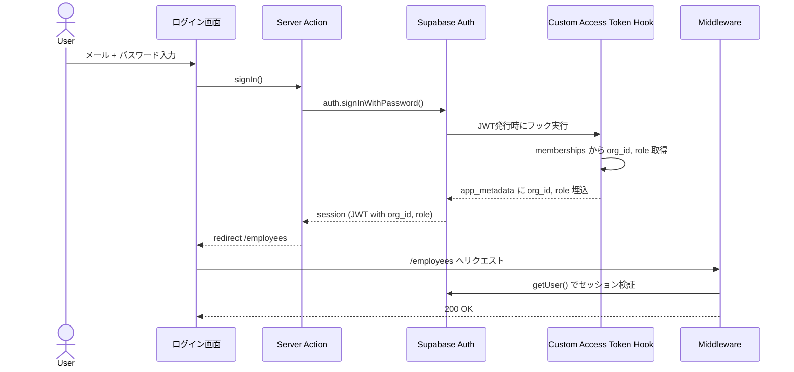
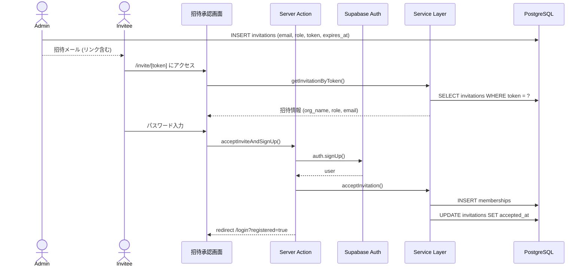
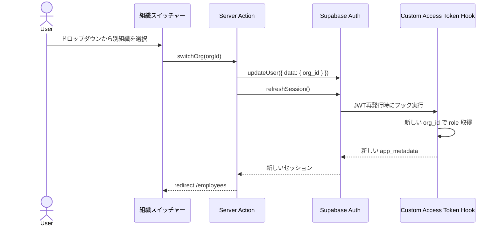
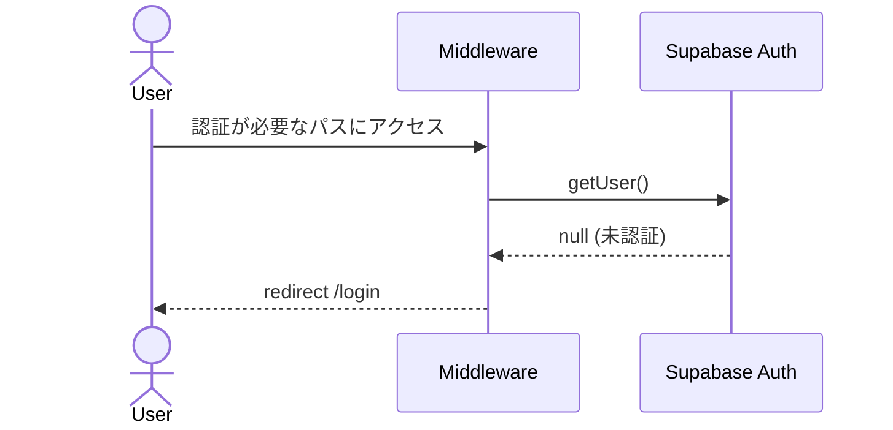

# ユーザーフロー図

## 主要フロー一覧

1. サインアップ → 組織作成
2. ログイン → ダッシュボード
3. 招待承認 → 組織参加
4. 組織切替
5. 従業員管理（CRUD）
6. 1on1 記録
7. 評価ワークフロー
8. AI機能（要約・分析・検索）

---

## 1. サインアップ → 組織作成

## 2. ログイン → ダッシュボード

## 3. 招待承認 → 組織参加

## 4. 組織切替

## 5. 未認証リダイレクト

