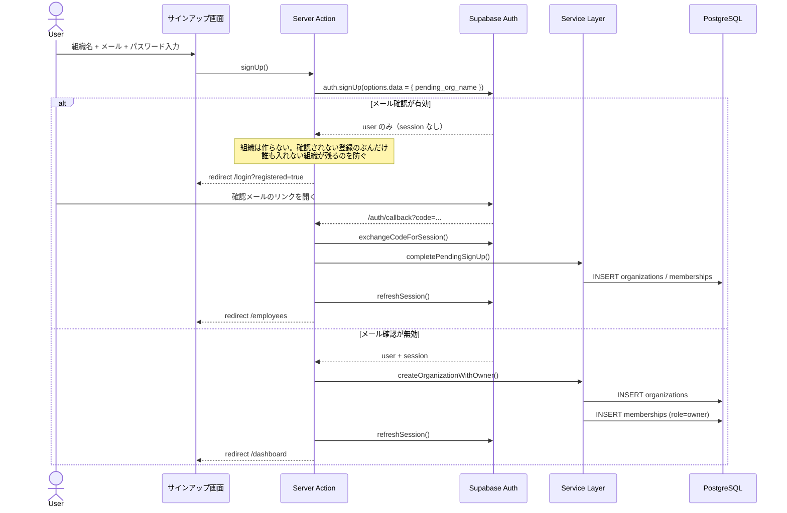
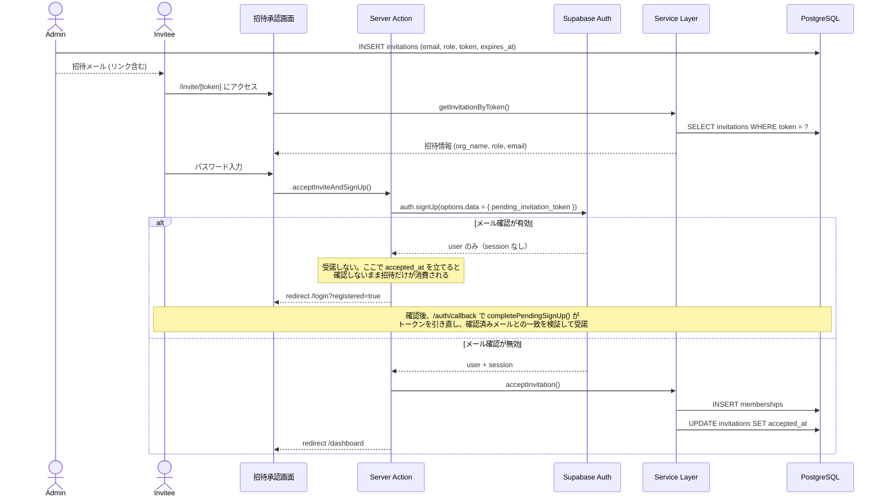
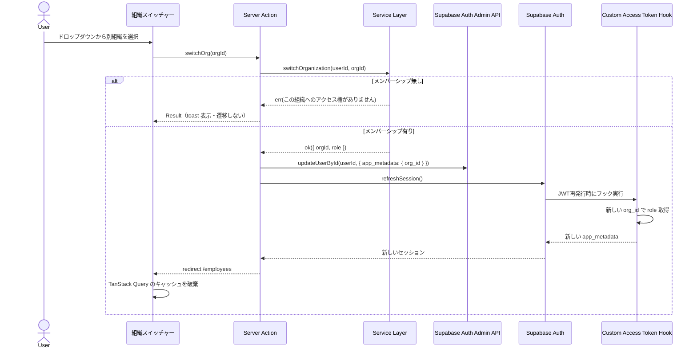
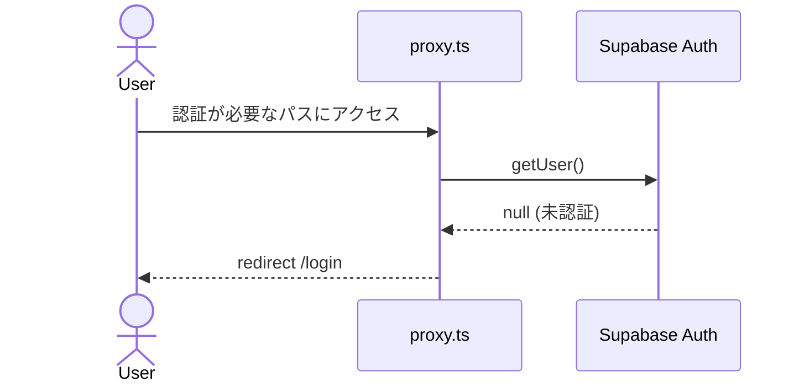
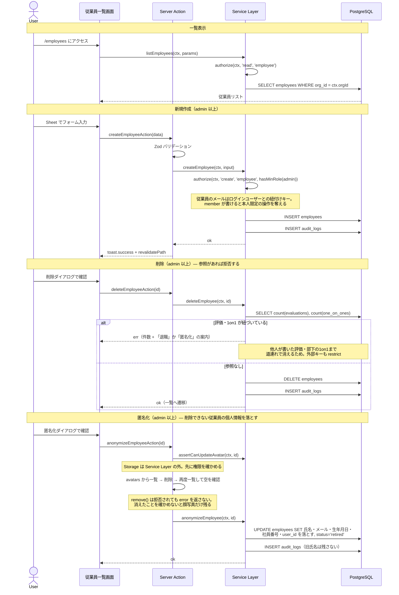
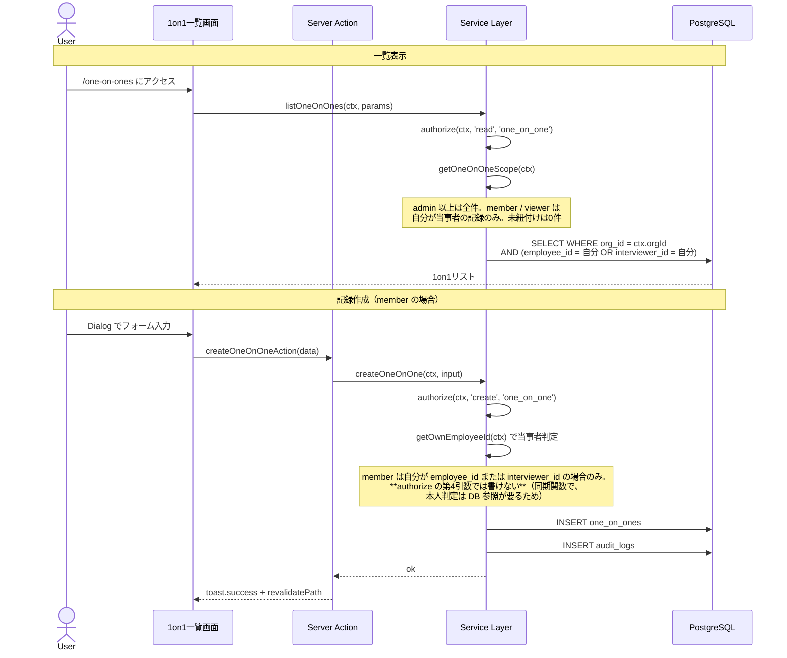
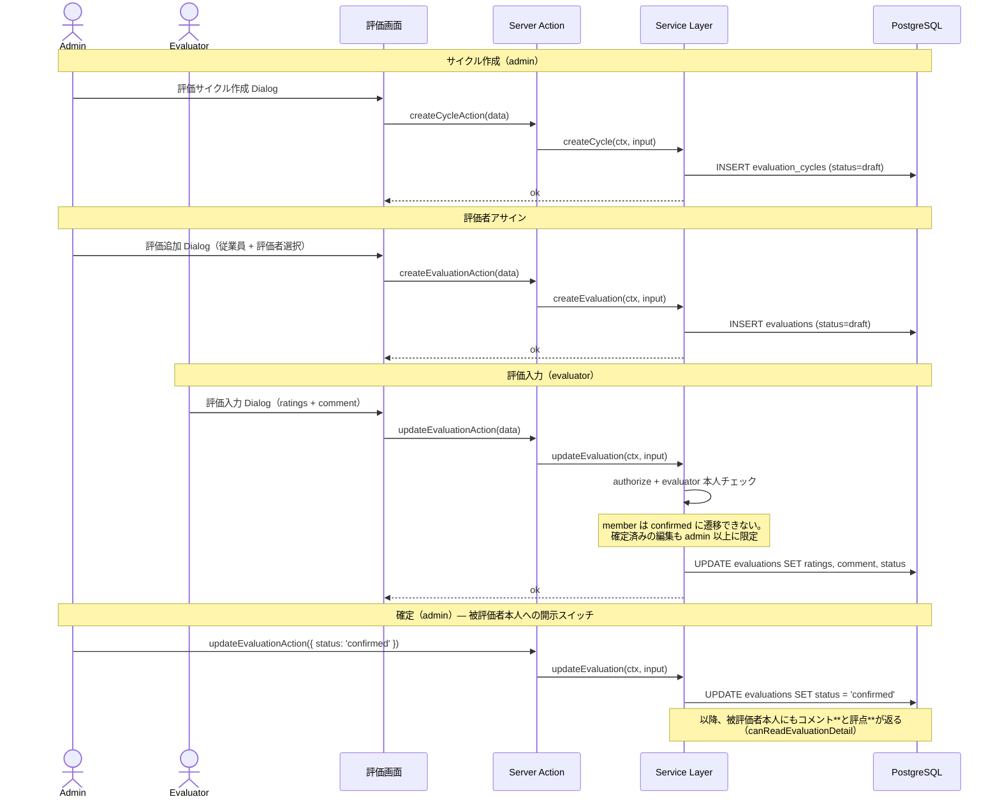
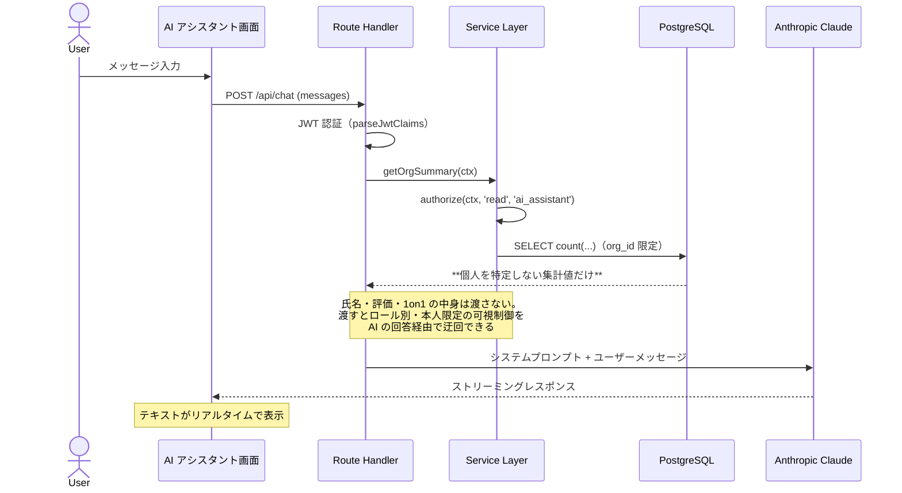

# ユーザーフロー図

## 主要フロー一覧

1. サインアップ → 組織作成
2. ログイン → ダッシュボード
3. 招待承認 → 組織参加
4. 組織切替
5. 未認証リダイレクト
6. 従業員管理（CRUD）
7. 1on1 記録
8. 評価ワークフロー
9. AI チャット

---

## 1. サインアップ → 組織作成

`refreshSession()` を省くとメンバーシップ作成前の JWT のまま画面に入り、
リダイレクトループになる。詳細は
[認証・認可モデル](../architecture/auth-and-authorization.md)。

## 2. ログイン → ダッシュボード

## 3. 招待承認 → 組織参加

## 4. 組織切替

`app_metadata` はクライアントから書き換えられない領域であり、更新には
service_role の Auth Admin API が要る。`updateUser({ data })` が書くのは
`user_metadata` で、Hook が読むのは `app_metadata` なので組織は切り替わらない。
service_role は RLS をバイパスするため、**書き込みの手前で必ず
`switchOrganization()` によるメンバーシップ検証を通す**。

`redirect()` は**クライアントサイドのナビゲーション**なので、React のツリー＝
`QueryClient` は生き残る。一覧系のクエリキーには組織を表す値が入っていないため、
何もしないと**切替後も前の組織のデータが描画される**（`staleTime` の間は再取得も
走らない）。`TenantQueryBoundary`（`src/components/layout/tenant-query-boundary.tsx`）が
テナントの変化を検知してキャッシュを捨てる。

## 5. 未認証リダイレクト

## 6. 従業員管理（CRUD）

削除と匿名化の判断は [ADR 0016](../adr/0016-employee-delete-is-blocked-anonymize-instead.md)。

## 7. 1on1 記録

## 8. 評価ワークフロー

評価コメント**と評点**の可視性は読み取り時にフィールド単位で制御している。
評点だけ素通しではコメントを伏せる意味が無いため、同じ条件で落とす。
詳細は [認可マトリクス](../database/authorization-matrix.md)。

## 9. AI チャット

